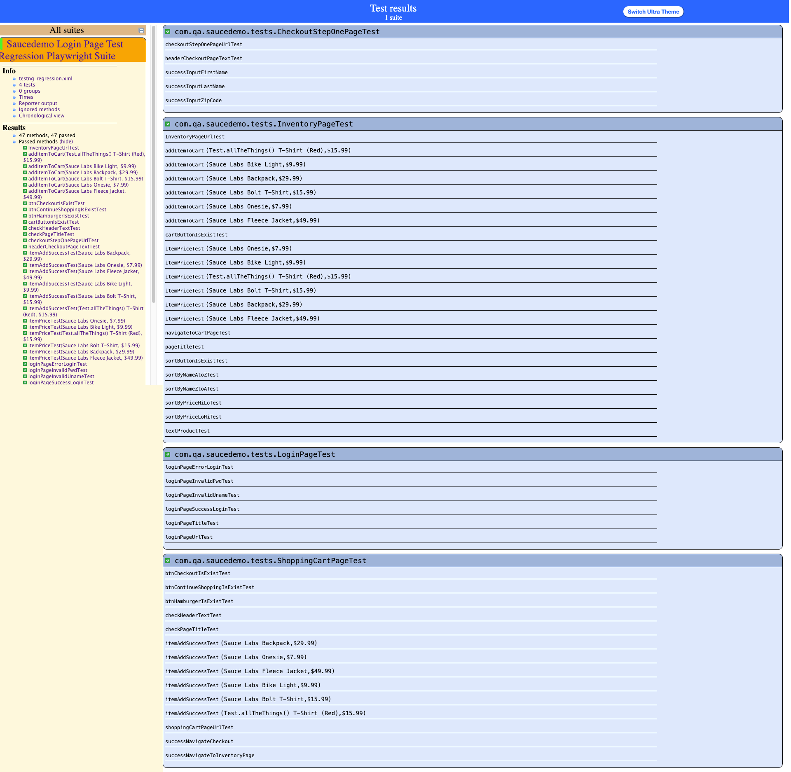

# Playwright Java Automation Project

## Overview
This project is a test automation framework built using **Playwright** and **Java**, designed for UI testing and UI end to end Testing of the [Saucedemo](https://www.saucedemo.com/) application. It leverages **TestNG** for test management and reporting, and follows the Page Object Model (POM) design pattern for maintainability and scalability.

## Project Structure

Below is a reference directory tree for the main components of the project:

```
seblak/
├── src/
│   ├── main/
│   │   └── java/
│   │       └── com/qa/saucedemo/
│   │           ├── constants/
│   │           │   └── AppConstants.java
│   │           ├── factory/
│   │           │   └── PlaywrightFactory.java
│   │           └── pages/
│   │               └── LoginPage.java
│   └── test/
│       ├── java/
│       │   └── com/qa/saucedemo/
│       │       ├── base/
│       │       │   └── BaseTest.java
│       │       └── tests/
│       │           ├── LoginPageTest.java
│       │           └── CheckoutStepOnePageTest.java
│       └── resources/
│           ├── config/
│           │   └── config.properties
│           └── testrunners/
│               └── testng_regression.xml
├── .vscode/
│   └── settings.json
├── README.md
└── pom.xml
```

### Key Directories and Files

- **src/main/java/com/qa/saucedemo/**
  - `constants/AppConstants.java`: Defines constants used throughout the project.
  - `factory/PlaywrightFactory.java`: Handles Playwright browser and context initialization.
  - `pages/LoginPage.java`: Page Object Model for the login page.

- **src/test/java/com/qa/saucedemo/**
  - `base/BaseTest.java`: Base class for all test cases, manages setup and teardown.
  - `tests/LoginPageTest.java`: Test cases for login functionality.
  - `tests/CheckoutStepOnePageTest.java`: Test cases for the checkout step one page.

- **src/test/resources/**
  - `config/config.properties`: Configuration file for environment variables (URL, browser, credentials, etc.).
  - `testrunners/testng_regression.xml`: TestNG suite XML for regression tests.

- **.vscode/settings.json**: VS Code settings If you are using VScode Text editor, including Maven test commands.

- **pom.xml**: Maven build file with dependencies and plugins.

## Getting Started

1. **Clone the Repository**
   ```sh
   git clone <repository-url>
   cd seblak
   ```

2. **Install Dependencies**
   - Ensure you have Java (JDK 11+) and Maven installed.
   - Run:
     ```sh
     mvn clean install
     ```

3. **Configure Properties**
   - Edit `src/test/resources/config/config.properties` with your environment details (URL, browser, credentials, etc.).

4. **Run Tests**
   - Use the provided TestNG XML file or the VS Code command:
     ```sh
     mvn clean test -Dsurefire.suiteXmlFiles=src/test/resources/testrunners/testng_regression.xml
     ```

## Running Tests

You can run all regression tests using:
```sh
mvn clean test -Dsurefire.suiteXmlFiles=src/test/resources/testrunners/testng_regression.xml
```
Or use the VS Code task defined in `.vscode/settings.json`.

## Extending the Framework

- Add new page classes in `src/main/java/com/qa/saucedemo/pages/`.
- Add new test classes in `src/test/java/com/qa/saucedemo/tests/`.
- Update or add constants in `AppConstants.java` as needed.

## Surefire result report example



## Conclusion

This framework provides a robust, scalable foundation for automating web application testing using Playwright and Java. It is easily extendable for additional test cases and supports parallel execution and configuration-driven testing.